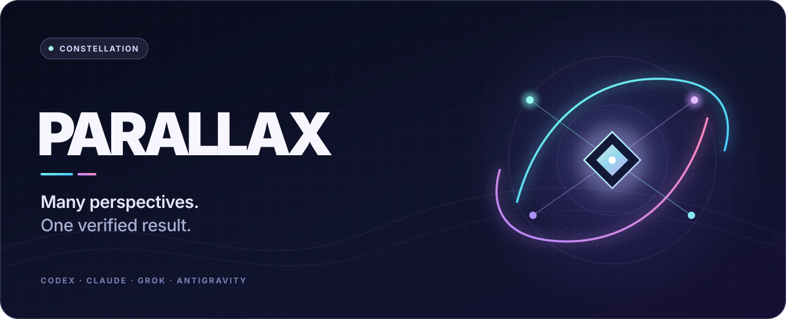
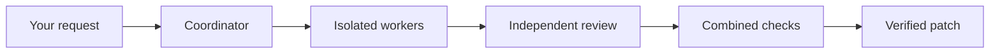

<p align="center"></p>

<p align="center"><strong>Many perspectives. One verified result.</strong></p>

<p align="center">
  <a href="https://github.com/ysham123/Parallax/actions/workflows/tests.yml"></a>
  <a href="LICENSE"></a>
  
</p>

Parallax runs a team of coding agents from different providers on your project and integrates only what survives independent review and your project's real checks. Codex, Claude Code, Grok Build and Antigravity can each coordinate, implement or review. Every agent works in an isolated checkout, a different provider reviews each change, and the combined result must pass your checks before a single line reaches your working tree. Each integrated result comes with a verification record.

It runs from Claude Code, from Codex, or from the command line, with a local Studio for watching and steering the work.

## Install

**Claude Code**

```text
/plugin marketplace add ysham123/Parallax
/plugin install parallax-team@parallax
```

**Codex**

```sh
codex plugin marketplace add ysham123/Parallax
codex plugin add codex-claude-team@codex-claude-team
```

Start a new chat after installing. The Codex install ID stays `codex-claude-team` so existing installations keep updating.

**From source**

```sh
git clone https://github.com/ysham123/Parallax.git
cd Parallax
python3 scripts/parallax.py doctor
```

Requirements: macOS, Python 3.10+, Git 2.38+, and at least one signed-in agent CLI (`codex`, `claude`, `grok`, `agy`) or an API key. Linux works where bubblewrap with user namespaces is available; CI covers it, including a live sandbox test. On first start, Parallax prepares a private Python environment from hash-locked dependencies. It changes no global packages or provider settings.

## Use it

In Claude Code:

```text
/parallax-team:review
/parallax-team:build Add rate limiting to the login endpoint
/parallax-team:studio
```

You can also just ask: *"Have Parallax review this change with Codex and Grok."*

In Codex:

> Use Parallax to build this feature. Codex leads, Claude and Antigravity implement, and Grok reviews.

| Mode | What happens |
| --- | --- |
| **Review** | Independent read-only assessments from each reviewer, then a blind synthesis that labels them A, B, C. |
| **Build** | The coordinator plans scoped tasks with file ownership. Workers implement in isolation, each change gets an independent review, and the combined result must pass your checks before integration. |
| **Compare** | Alternative complete implementations, each checked against the same commands. The selected candidate is verified again before integration. |

The default team uses Codex as coordinator, Claude Code and Antigravity as implementers and Grok Build as reviewer. It runs at high effort, with three concurrent workers, two repair rounds per task and a 45-minute limit. Change any of it in Studio or in the run specification. Explicit model and effort choices are never silently substituted.

## How a run reaches your project



- **Your work is preserved.** Parallax snapshots staged, unstaged and untracked changes without touching your index, works in private worktrees, and applies only the verified patch. Conflicts, failed checks or unsupported setups stop as **Needs attention**, with all work kept.
- **Checks are the gate.** Integration requires meaningful check commands, given as argv arrays such as `["npm", "test"]`. An agent saying tests passed is not verification.
- **No shared transcript.** Every model call receives a compact, role-scoped packet compiled from saved state, never a growing conversation. Coordinator turns, repairs and reviews start fresh sessions. Workers see only their own task, and reviewers never learn who wrote the change they judge.
- **Exploration in isolation.** When approaches genuinely differ, the coordinator can run two or more variants of a task in separate checkouts. Each is reviewed and checked independently, and only the selected one merges.
- **Project memory.** A local idea graph records what earlier runs in the project tried and what the evidence showed. After each run, one isolated session distills at most three lessons, each grounded in recorded evidence. Only coordinators read memory, as dated observations rather than rules. Turn it off with `PARALLAX_MEMORY=off`.
- **Evidence you can keep.** The verification record lists the gates, settings, checks and patch hash, without prompts or raw sessions. It is evidence, not a correctness guarantee.

See [architecture](docs/ARCHITECTURE.md) for the full design and [real-project delivery](docs/DELIVERY.md) for setup behavior.

## Studio

Studio opens on your active or most recent run. The agent graph shows who coordinates, implements and reviews. The task graph shows dependencies, repairs, reviews and checks. When the coordinator explores alternatives, the task graph shows each variant by round and marks the one it kept. Inspectors show what each agent's context packet contained, by section and size. New run shows what project memory has learned, with controls to disable a lesson or forget it all. You can steer a run at its next checkpoint, pause it, stop it or resume it. **Review** brings together baseline and final checks, the combined diff, findings and the verification record.

Studio binds to loopback only. Its launch link exchanges a local access token for an HttpOnly session cookie and removes the token from the address bar, and Studio rejects cross-origin requests.

## Providers

| Provider | CLI | API |
| --- | --- | --- |
| Codex | `codex` | OpenAI Responses |
| Claude Code | `claude` | Anthropic Messages |
| Grok Build | `grok` | xAI Responses |
| Antigravity | `agy` | Gemini through Google's OpenAI-compatible endpoint |

CLI connections use your existing sign-ins. API keys are stored in macOS Keychain or referenced by environment variable. They never appear in run specifications, profiles, the database or browser storage. Custom models can connect through any OpenAI-compatible HTTPS endpoint with an explicit model and capability catalog. Prompts and the relevant project content go to the endpoints you select; orchestration and history stay on your machine.

## Hosted Studio and paired machines

Parallax can also run as a hosted Studio on Vercel with a runtime on Railway. Visitors sign up with email, GitHub or Google and get a private workspace. Their agents run on machines they pair with an outbound worker, scoped to exact approved project folders. Execution, provider sign-ins and API keys stay on those machines. Only run evidence is mirrored to the workspace, within per-workspace limits. See [deployment](docs/DEPLOYMENT.md) and [paired machines](docs/LOCAL-WORKERS.md). The hosted Studio publishes its privacy policy, terms and support page at `/privacy`, `/terms` and `/support`.

## Command line

```sh
python3 scripts/parallax.py doctor                      # provider readiness
python3 scripts/parallax.py studio --workspace PATH     # open Studio
python3 scripts/parallax.py assess --workspace PATH     # project readiness and checks
python3 scripts/parallax.py run --spec run.json --wait  # start a run
python3 scripts/parallax.py status RUN_ID
python3 scripts/parallax.py steer RUN_ID --message "Keep the public API stable"
python3 scripts/parallax.py receipt RUN_ID              # verification record
python3 scripts/parallax.py worker --url URL --workspace PATH   # pair with a hosted Studio
```

The CLI, Studio and the bundled stdio MCP server share one local runtime, and inputs and results follow the versioned [contracts](src/parallax/models.py). `PARALLAX_HOME` selects another state directory. The original `scripts/claude_bridge.py` interface remains supported.

The optional [remote MCP integration](docs/REMOTE-MCP.md) lets account-authorized clients use paired machines through hosted Studio. It is disabled by default and requires Supabase OAuth setup. `python3 scripts/build_openai_plugin.py --draft` prepares the separate OpenAI directory package; the existing local plugins keep their install IDs.

## Limits

- Build and Compare need a Git repository. Review works in any folder.
- Git submodules and symlinks that point outside the project need manual handling.
- Automatic environment setup covers Python requirements and PEP 621 dependencies, and locked npm projects with lifecycle scripts disabled. Yarn, pnpm and npm workspaces need a prepared environment.
- API command execution currently requires the macOS sandbox. SSH workers and remote filesystem mounts are not supported.
- Parallax changes your working tree only. Committing, pushing and deploying stay with you.

## Develop

```sh
uv sync --extra test
PYTHONPATH=src uv run python -m unittest discover -s tests
npm ci --prefix studio && npm run build --prefix studio
python3 scripts/validate_release.py
```

Tests use deterministic fake agents, so no provider is called. CI runs Python 3.10 and 3.13 on macOS and Linux, plus Studio and container checks. Recorded native and team runs are in [docs/validation](docs/validation). See [CONTRIBUTING.md](CONTRIBUTING.md), [SECURITY.md](SECURITY.md), [CHANGELOG.md](CHANGELOG.md) and [UPGRADE.md](UPGRADE.md).

## License

MIT. Provider marks identify their services and remain their owners' trademarks; see [asset provenance](studio/ASSETS.md).
