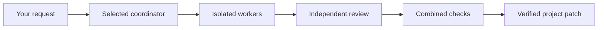

<p align="center"></p>

<p align="center"><strong>CONSTELLATION · PARALLAX 1.0</strong><br>Many perspectives. One verified result.</p>

Parallax turns an outcome into a reviewed, checked project patch using Codex, Claude Code, Grok Build, and Antigravity. Invoke it from your existing Codex chat, choose your CLI or API agents, and let the team implement, review, repair and verify the result. Studio shows the work and its evidence. Integration preserves your staging and unrelated edits.

The focus is **verified integration for mixed-model coding teams**. Every integrated result has a downloadable verification record with the current review and check gates, preservation evidence, and patch hash. See [why Parallax](docs/POSITIONING.md) for the target user, competitive context and evidence behind that promise.

## Meet the team

| Provider | Native command | Selection |
| --- | --- | --- |
| Codex | `codex` | Account model catalog and native reasoning effort |
| Claude Code | `claude` | Installed CLI aliases and supported effort |
| Grok Build | `grok` | Native model IDs and cached model-specific effort menus |
| Antigravity | `agy` | Account model variants and their supported effort |

Choose a signed-in local CLI or an API connection. OpenAI and xAI use Responses, Claude uses Messages, and Gemini uses Google's documented OpenAI compatibility endpoint. Gemini API is a separate connection from the Antigravity CLI. Custom models can connect through an OpenAI-compatible endpoint with an explicit model and capability catalog.

Orchestration and history stay on your machine; prompts and relevant project content go to the selected inference endpoint. Account access and CLI capabilities can differ. Studio identifies catalog provenance and shows requested and effective settings without inventing usage or cost.

## Install

You need macOS, Python 3.10+, Git 2.38+, and either signed-in CLIs or configured API connections. The CI workflow targets macOS and Linux; local release validation was performed on macOS. Native integrations must pass the compatibility checks on your machine. Node is only needed to develop Studio.

```sh
codex plugin marketplace add ysham123/codex-claude-team
codex plugin add codex-claude-team@codex-claude-team
```

Start a new Codex chat after installing or upgrading. The plugin's stable install ID remains `codex-claude-team`; its display name is Parallax. The launcher prepares a private Python environment with hash-locked dependencies for the installed release and Python version. No global Python packages or provider settings are changed.

In Codex, say:

> Open Parallax Studio for this project.

Or:

> Use Parallax to build this feature. Codex leads, Claude and Antigravity implement, and Grok reviews. Use my Quality preset.

The checked-in 1.0 release is prepared locally before publication. Until the GitHub release is published, the commands above install the currently published repository version. See [UPGRADE.md](UPGRADE.md) for local testing and migration.

## Studio

**Team** selects connections, providers, models, effort, roles, checks, and limits. Connection details open in a drawer so setup stays focused. Save configurations as reusable presets. **Run** shows an interactive task graph with pan, zoom, fit, and a task inspector, plus agent activity, checkpoint steering, and live status. **Review** brings together the verification record, diff, independent findings, check output, effective settings, and reported usage. Download the record as JSON and the patch separately. Unknown evidence stays unknown; the record is not a correctness guarantee or a signed attestation.

- **Review** runs independent assessments and synthesizes disagreements.
- **Build** divides work into scoped tasks, reviews each change, verifies the combined result, and integrates it.
- **Compare** builds isolated alternatives, checks each against the same commands, and verifies the selected candidate before integration.

Codex is the default coordinator. Every selectable coordinator runs in a dedicated CLI or API session, distinct from the Codex chat that starts the team. Studio does not change that chat's model.

Quality first uses high supported effort, independent review, three concurrent workers, two repair rounds per task, and a configurable 45-minute limit. Models initialize from discovered/configured provider defaults. Explicit selections are never silently substituted.

## How a run reaches your project



The runtime validates structured coordinator actions and owns scheduling, budgets, process cancellation, and integration. Native recursive teams are disabled. Workers have explicit relative file ownership. Antigravity uses gated edit/read tools; its project checks are executed by the runtime. Other providers expose scoped shell execution only when the installed platform can enforce it.

Build and Compare require a Git repository root. Parallax snapshots staged changes, unstaged changes, and nonignored untracked files without modifying your index. It uses private worktrees, merges accepted changes privately, and applies only the verified patch. Your existing staging and unrelated edits are preserved. Conflicting edits, failed checks, or unsupported configurations produce **Needs attention** with work preserved. Submodules and external symlinks currently need manual handling.

Meaningful checks are required for automatic integration. Add direct argv commands in Studio, such as `["npm", "run", "test:ci"]`. The coordinator may propose checks discovered from project configuration. An agent's claim that tests passed is not verification. Python requirements.txt and PEP 621 dependencies install into a private run environment. Locked npm dependencies install in the isolated checkout with lifecycle scripts disabled. Other package managers require a prepared project environment.

Pause stops new assignments while active work finishes. Stop terminates managed processes and preserves partial work. Resume reconciles saved state before proceeding. Runs, provider sessions, and replayable events are stored locally outside the project.

Parallax integrates project changes; publishing, deployment, and pushing require their own user request.

## CLI and automation interfaces

From a clone or installed plugin:

```sh
python3 scripts/parallax.py doctor
python3 scripts/parallax.py studio --workspace /path/to/project
python3 scripts/parallax.py models grok
python3 scripts/parallax.py connections
python3 scripts/parallax.py models codex --transport api --connection-id codex-api
python3 scripts/parallax.py run --spec /path/to/run.json
python3 scripts/parallax.py status RUN_ID
python3 scripts/parallax.py receipt RUN_ID
python3 scripts/parallax.py pause RUN_ID
python3 scripts/parallax.py steer RUN_ID --message 'Preserve the public API'
python3 scripts/parallax.py resume RUN_ID
python3 scripts/parallax.py cancel RUN_ID
```

`run --wait` waits for a checkpoint or terminal result. `history` lists recent runs. `profiles --save NAME --spec FILE` saves a team. Inputs and results use the versioned [shared contracts](src/parallax/models.py). CLI, Studio, and the bundled stdio MCP server use the same persistent runtime. MCP tools cover diagnostics, connections, models, profiles, run lifecycle, and Studio. Configure API secrets in Studio or refer to environment variables from connection specifications. The bundled MCP configuration forwards standard provider key variables; custom names also need the Codex host environment allowlist configured.

Studio binds only to loopback. Its launch URL exchanges a local token for an HttpOnly session cookie, removes the token from the URL, and rejects cross-origin requests. Native sign-ins remain with their CLIs. API secrets are stored in macOS Keychain or referenced by environment variable; they never appear in run specs, profiles, SQLite metadata, or browser local storage. Linux supports environment references. Protect local history as project data. `PARALLAX_HOME` selects an alternate state directory for testing.

## API connections and remote endpoints

Open Connections in Team, choose the provider, and enter an API key or environment-variable name. Test the connection to discover account models without starting inference. Select a model explicitly. Maintained and user-declared effort capabilities are labeled; unsupported or unverified selections fail explicitly. Custom endpoints require HTTPS, except loopback services. Your chosen endpoint receives the relevant project content.

API workers have runtime-owned file tools and a bounded tool loop, with file ownership, command restrictions, private session journals, and cancellation. Read-only roles receive no write or command tools. API command execution currently requires the macOS sandbox. API activity streams at request/tool/message boundaries; native CLIs retain their native stream events. Live API inference needs separately configured credentials and is not established by fake endpoint tests.

Remote inference endpoints work through the API transport. SSH workers, remote filesystem mounts, external MCP tools, and provider-hosted agent execution are not enabled in 1.0. They need an authenticated executor protocol, capability negotiation, independent workspace snapshots, and the same local integration gates. The [architecture notes](docs/ARCHITECTURE.md) explain these boundaries.

## Original Claude bridge

Existing scripts remain supported:

```sh
python3 scripts/claude_bridge.py --workspace /path/to/project --mode consult --prompt-file request.txt
```

The original CLI arguments and JSON result fields remain available, including `--resume`, `--timeout`, and explicitly delegated `--mode edit`. This compatibility path is independent of the autonomous team workflow.

## Develop and verify

```sh
uv sync --extra test
PYTHONPATH=src uv run python -m unittest discover -s tests -v
cd studio
npm ci
npm run build
```

Studio's production build is copied into the Python package. Runtime users do not need npm. Deterministic tests exercise adapter contracts, dirty-worktree integration, rejected reviews, checks, cancellation, auth/origin protection, and recovery. Native smoke and team-demo evidence is under [docs/validation](docs/validation).

The project is MIT licensed. Provider marks identify the services and retain their owners’ trademark rights; see [asset provenance](studio/ASSETS.md). See [CONTRIBUTING.md](CONTRIBUTING.md), [CHANGELOG.md](CHANGELOG.md), and [UPGRADE.md](UPGRADE.md).
