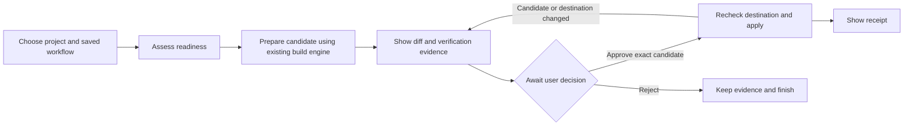

# Proposal: reusable, resumable coding workflows

Status: proposed, October 9, 2026. No LangGraph dependency or workflow runtime is implemented by the OAuth/MCP PR. This document is the decision brief for the next phase.

## Recommendation

Keep Parallax as the application people use. Introduce LangGraph internally for saved workflow execution, beginning with a **verified change workflow that can wait for approval and survive a worker restart**.

The product benefit should be concrete: choose a saved workflow, request a change, inspect its candidate and verification evidence, and approve the exact change later. Users should not need to write graphs, build provider adapters, manage checkpoints, or reconstruct what happened after a disconnect.

Adding a framework alone does not make Parallax harder to replace. A developer can build an alternative with LangGraph. Parallax earns its place by making the complete coding process reliable and usable: locally configured providers, approved projects, isolated worktrees, independent review, real checks, preservation of staged work, and visible evidence. The proposed integration should improve that experience and reduce the custom workflow machinery we maintain.

## What exists already

The code reviewed at `35568c1` already provides substantial execution infrastructure:

| Existing component | Responsibility to preserve |
| --- | --- |
| `Engine._build_run` and `Store.actions` | Structured coordinator decisions and durable action records |
| `Engine._reconcile_actions` and process reconciliation | Detect completed effects and interrupted actions without blindly replaying them |
| `Engine._review_run` | Isolated assessments and synthesis |
| `Engine._verify`, `_integrate`, and `WorkspaceManager` | Independent verification, candidate/destination checks, and application that preserves user work |
| `WorkerRuntime` and `ExecutorHub` | Approved project boundaries, dispatch records, account-scoped relay, and offline evidence |
| Studio, local plugins, and remote MCP | Ways to start work and inspect results |

The existing `integrate=false` option can preserve a verified candidate. It does **not** expose a durable, user-authorized “apply this exact candidate later” operation. That missing operation is a real part of the proposed work. Existing saved run profiles are useful defaults, but they are not versioned, multi-stage workflows with durable approval state.

## Options

| Approach | Benefit | Cost or limitation | Decision |
| --- | --- | --- | --- |
| Extend the current custom engine | Smallest dependency change; complete control | We own template execution, checkpoint transitions, and approval orchestration | Keep as the comparison baseline |
| Wrap today's run in one LangGraph node | Quick proof that the library connects | Little user benefit; adds dependency and state without improving a workflow | Skip as a shipped feature |
| Use LangGraph for workflows above Engine operations | Reusable sequencing, persisted workflow state, and explicit waits while preserving coding execution | Requires careful reconciliation between checkpoints and real effects | Recommended pilot |
| Replace the engine with a general agent graph | Broad redesign flexibility | Rebuilds mature project, process, verification, and recovery guarantees | Outside this phase |

LangGraph provides low-level stateful orchestration and can be used without adopting LangChain's model abstractions. It supports deterministic steps alongside agent-driven work. This makes it a plausible internal component while retaining Parallax's existing provider integrations. [Official overview](https://docs.langchain.com/oss/python/langgraph/overview)

## The first user-visible improvement

Ship one saved workflow, “Verified change,” with editable task inputs, provider choices, checks, budget limits, and approval policy. Store an immutable template version with each execution. Start with a form and a readable progress view; a general drag-and-drop graph editor is unnecessary for this pilot.

The build engine continues to handle planning, implementation, independent review, checks, and its bounded repair loop. LangGraph coordinates the surrounding workflow. Its saved state holds references to engine evidence, not a second copy of the whole run.

The proof should be easy to demonstrate: generate a verified candidate, close Studio, restart the worker, reconnect, and approve the same candidate without paying for another successful build. If the project changed while waiting, explain what changed and require fresh verification and approval before application.

LangGraph checkpoints associate saved execution state with a thread. Its interrupts can suspend a workflow until input arrives. On resume, the interrupted node starts again, so code before the interrupt can run again. A checkpoint therefore does not guarantee that an external write or paid provider call happens only once. [Persistence](https://docs.langchain.com/oss/python/langgraph/persistence), [interrupt semantics](https://docs.langchain.com/oss/python/langgraph/interrupts)

## Integration boundaries

- **Run the workflow on the paired worker.** Keep the graph supervisor and durable checkpointer alongside local execution. Hosted Studio continues to relay authorized requests and display a bounded projection. A cloud disconnect must not terminate the local workflow.
- **Give each fact one owner.** LangGraph owns workflow position and pending waits. Parallax owns run outcomes, candidate contents, verification evidence, approvals, and filesystem effects. Graph state stores `workflow_id`, template version, stable step IDs, engine run IDs, evidence digests, and budget totals.
- **Make start/apply effects reconcilable.** Before starting a run, atomically record a stable workflow-step key with the engine run ID. If a process dies before the graph checkpoint is saved, find that run by the key; do not start another. Add this engine boundary rather than assuming the existing relay request ID covers graph retries. Apply needs its own durable intent/result and recovery logic too.
- **Add a narrow candidate-application API.** Bind approval to the account/workspace, worker, approved project, candidate digest, source fingerprint, verification policy version, and evidence digest. Reacquire the project lock and check these at application time. A changed candidate or refreshed destination invalidates approval. Reuse the engine's checks and preservation rules.
- **Keep approval separate from side effects.** The waiting node presents the candidate and validates the decision. The following application step rechecks authorization and state. Neither resumed graph input nor a checkpoint is an authorization credential. Repeated approval requests must return the prior result or a clear conflict.
- **Limit checkpoint content.** Keep provider credentials, raw source, OAuth tokens, and full transcripts out of graph state. Start with a local durable checkpointer and a versioned, validated state schema. Checkpoint loading is trusted internal storage, not a user-uploaded workflow feature. No LangSmith tracing or hosted graph service is required for this proposal; external tracing would need explicit opt-in.
- **Bound recovery and spending.** Persist consumed budget across restarts. Retry only operations whose prior effects are known; ambiguous interrupted execution goes to reconciliation. The pilot resumes workflow stages, not arbitrary unfinished provider instructions. Account revocation still blocks new remote commands; workflow cancellation must use the existing process controls.

Templates should initially be application-owned definitions composed from allowed operations. An uploaded template must not introduce Python code, shell commands, new projects, providers, or permissions. A future extension SDK can be considered after the execution contract is proven.

## Delivery sequence and acceptance

1. **Prove execution semantics locally.** Pin compatible LangGraph/checkpointer versions and resolve them against Parallax's Python 3.10/3.13 and locked Pydantic stack. Build the workflow-step identity boundary and a durable checkpoint spike. Stop the process immediately before and after run creation; verify one engine run and one billable dispatch. Do not assume a current package release is compatible until this passes.
2. **Implement candidate approval and application.** Add the explicit state transitions and exact-candidate checks. Test restart while waiting, approval replay, a concurrent application attempt, changed destination, changed candidate, missing evidence, and an interrupted application. No automatic reapplication after an ambiguous crash.
3. **Ship one complete Studio workflow.** A saved template, visible steps, inspectable evidence, approval/rejection, cancel, and a receipt. Add only the scoped relay routes needed for it. Keep the existing review/build commands working. Remote MCP workflow controls can follow after the Studio flow proves the contract.
4. **Measure before expanding.** Compare the same fixture tasks against the current engine: successful outcomes, duplicate dispatches, provider calls after restart, elapsed time, token usage where providers report it, and user actions required. Require zero duplicate side effects in fault-injection tests and no re-execution of completed successful stages. Report missing usage data instead of estimating savings as fact.

The adoption decision should depend on whether the pilot makes workflow sequencing and resumption simpler while preserving the existing guarantees. If most of the work still becomes a second custom scheduler around LangGraph, keep the user-facing improvement and reconsider the dependency.

Once the pilot passes, reuse the same workflow mechanism for selected review findings to verified fixes, bounded comparisons of alternative solutions, and repository-specific maintenance recipes. Each needs its own evidence and acceptance criteria. A broad engine rewrite or a generic graph platform is not needed to deliver this first substantial improvement.
